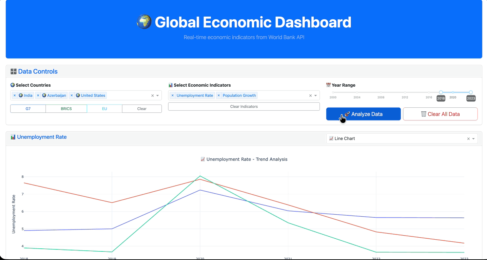

# 🌍 World Economic Dashboard

[](https://www.python.org/) [](https://dash.plotly.com/) [](https://plotly.com/python/) [](LICENSE) [](https://github.com/Manojgowda898/world-economic-dashboard)


An **interactive, real-time economic data analysis platform** powered by the **World Bank Open Data API**.  
Analyze, visualize, and export **economic indicators for 200+ countries** in a professional, intuitive dashboard interface.

---

## 📖 Project Overview

The **Global Economic Dashboard** provides:  

- Real-time access to **World Bank economic data**  
- **Customizable charts** for multiple countries and indicators  
- **CSV & PDF exports** for reporting  
- **Interactive visualizations** for meaningful insights  

### 🔹 Core Idea

Instead of manually collecting economic data, the dashboard:  

- Fetches **live economic data** from the World Bank API  
- Provides **user-friendly charts** for multi-country comparison  
- Supports **data import/export** for custom analysis  

### 🔹 Features

- 🌐 **200+ countries** and country groups (G7, BRICS, EU)  
- 📊 **100+ economic indicators** (GDP, Inflation, Population, Trade, Employment)  
- 🎛️ **Interactive charts** – Line, Bar, Scatter, Area, Heatmap  
- 📈 Multi-indicator comparison – each indicator can have its own chart type  
- 📤 Export **analysis & charts** to CSV or PDF  
- 📥 Import your own CSV datasets  
- ⚙️ **Smart launcher (`run_dashboard.py`)** for:  
  - Dependency checks & auto-install  
  - Directory setup (`cache/`, `logs/`, `exports/`, `temp_uploads/`)  
  - API connectivity check  
  - Optional system diagnostics  
- 🎨 Responsive UI using **Dash + Bootstrap**  
- ⏱️ Real-time updates from the **World Bank API**  

---

## 📂 Project Structure

## 📂 Project Structure
```
world-economic-dashboard/
├── __pycache__/          # Python cache
├── cache/                # Cached API responses
├── exports/              # Exported analysis
│   ├── csv/              # CSV exports
│   └── pdf/              # PDF exports
├── logs/                 # Application logs
├── screenshots/          # Project screenshots
├── temp_uploads/         # User-uploaded CSV files
├── config.py             # Configuration file (API keys, paths)
├── main.py               # Main dashboard application (Dash)
├── run_dashboard.py      # Smart launcher script
├── requirements.txt      # Python dependencies
└── README.md             # Project documentation
```

---

## 🛠️ Tech Stack

- **Frontend:** Dash, Dash Bootstrap Components, Plotly  
- **Backend:** Python, Requests, Pandas  
- **Data Source:** [World Bank API](https://data.worldbank.org/)  
- **Export:** CSV (Pandas), PDF ([FPDF2](https://pyfpdf.github.io/fpdf2/))  
- **Utilities:** psutil (optional), kaleido (optional)  

---

## ⚡ Installation Guide


# Clone repository
```
git clone https://github.com/Manojgowda898/world-economic-dashboard.git
cd world-economic-dashboard
```

# (Optional) Create virtual environment
```
python -m venv venv
source venv/bin/activate   # Mac/Linux
venv\Scripts\activate      # Windows
```

# Install dependencies
```
pip install -r requirements.txt
```

---

## ▶️ How to Run

### 1. Launch Dashboard
```
python run_dashboard.py
```

### 2. Open in Browser
| Local URL | Network URL |
|-----------|-------------|
| [http://localhost:8050](http://localhost:8050) | [http://0.0.0.0:8050](http://0.0.0.0:8050) |


### 3. Optional Steps
- Run detailed system diagnostics (memory, disk, internet)  
- Import custom CSV datasets for analysis  

## 📸 Screenshots & Demo

### Dashboard Home


### Country & Indicator Selection


### Multi-Indicator Visualization


### Project Demo


### PDF Export Example
[View PDF Export Example](screenshots/example.pdf)

---

## 🔄 Workflow

1.  Launch `run_dashboard.py`
2.  Select countries and indicators
3.  View charts and customize visualization
4.  Export results to CSV/PDF if needed
5.  Import custom datasets for additional analysis

---

## 🌱 Future Improvements

* Add predictive analytics / ML forecasting for economic indicators
* Implement user authentication for personalized dashboards
* Deploy with Docker + Cloud hosting for public access
* Enhance PDF exports with multi-page executive summaries
* Add multi-language support

---

## 📜 License

This project is licensed under the **MIT License** – see the [LICENSE](LICENSE) file for details.

---

## 🤝 Contributing

Contributions are welcome! Please check [CONTRIBUTING.md](CONTRIBUTING.md).

---

## 🙌 Acknowledgements

* [World Bank Open Data](https://data.worldbank.org/) for the API
* Dash and Plotly teams
* FPDF2 for PDF export functionality
* Python community for libraries: Pandas, Requests, psutil, Kaleido


